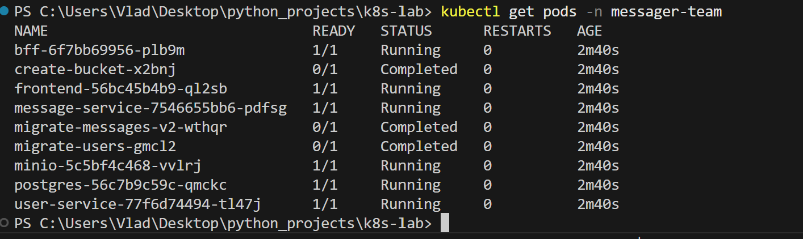
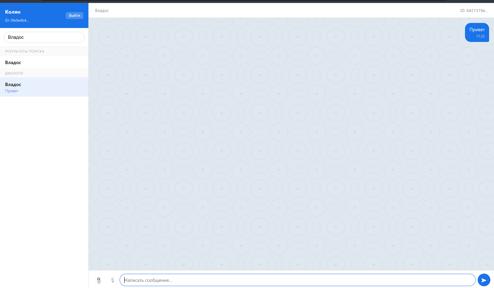
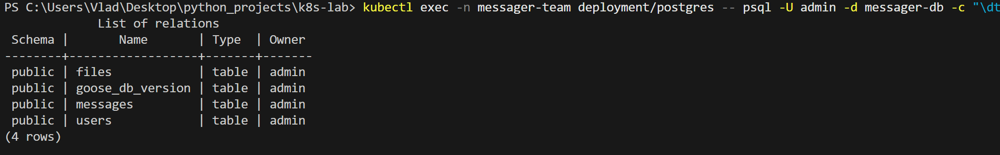
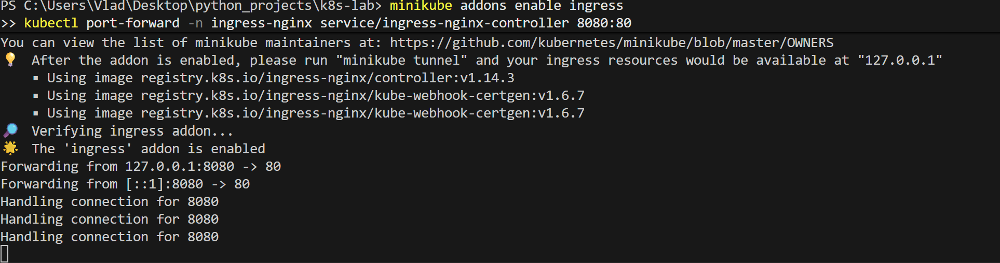
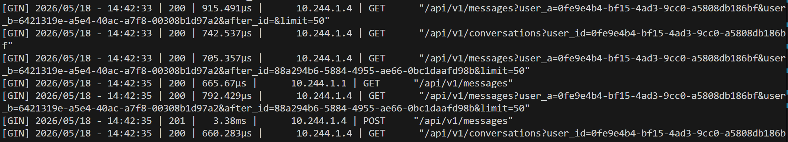
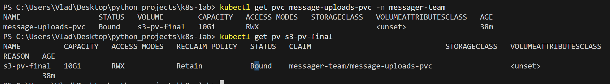
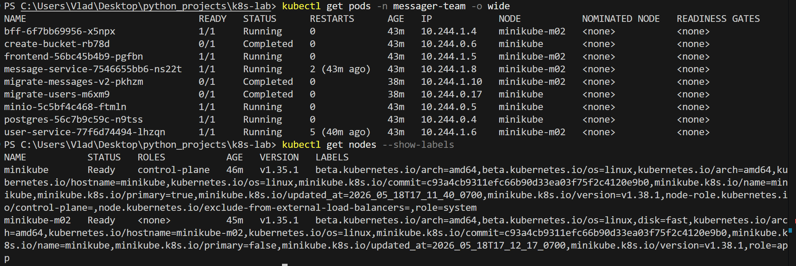
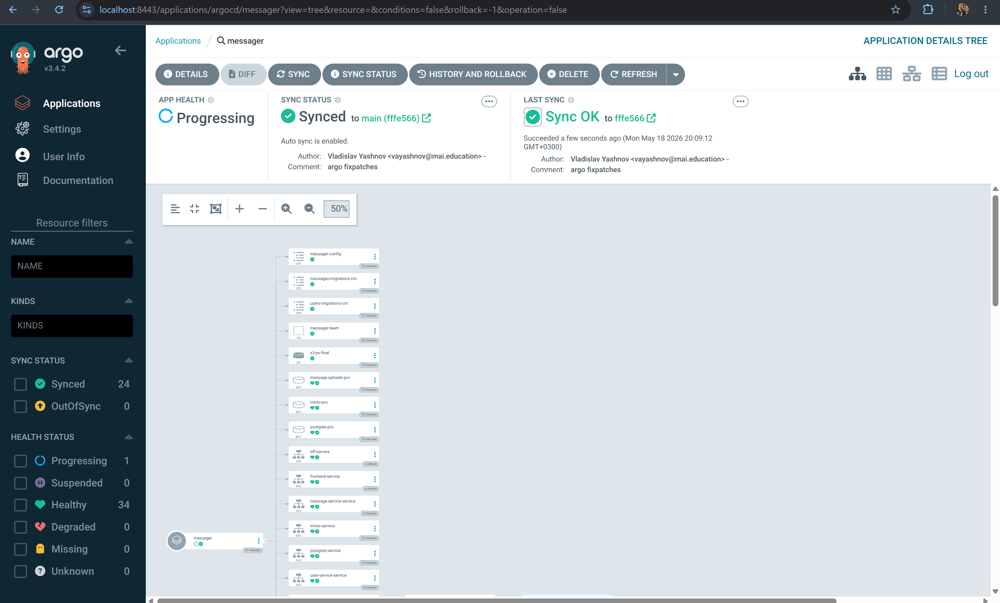
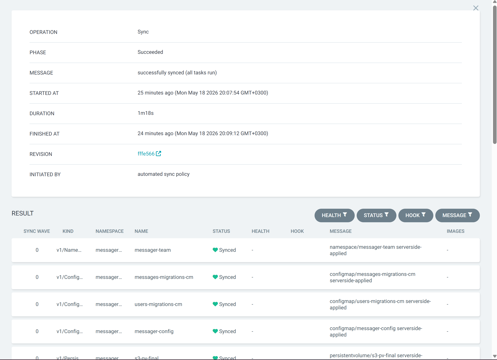

# Ручной запуск
## Поды в рабочем состоянии:

*Рестарты только при запуске из-за проблем с миграциями*
## Приложение работает:

## Таблицы созданы:

## Доступ через ингресс:

## В логах видно отправку сообщений:

## S3-PV связан с PVC:

## NodeAffinity работает:

# ArgoCD
## Synced & Heathy

## Stats
